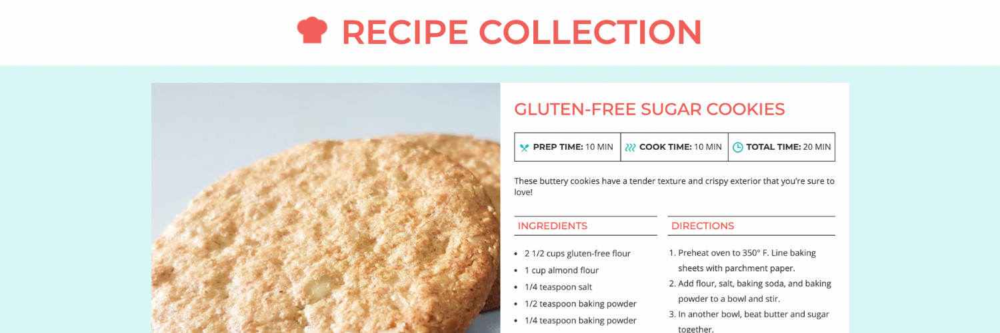

# Recipe Card Collection site

In this project, several recipe cards (which include ingredients, directions, an image, and prep + cook times) are styled using CSS for a fun mini website using semantic HTML5.

It can be viewed here: https://victoria-farr.github.io/recipe-card-site/

## Prerequisites

- A simple, up-to-date browser than can read and display HTML5 & CSS is all that's needed. 🤓

```
It was created using Skillcrush.com coursework: <https://github.com/skillcrush>
```

## Contributors

The following contributed to this project:

- [Skillcrush.com](http://skillcrush.com/) coursework: [https://github.com/skillcrush](https://github.com/skillcrush)
- [@victoria-farr](https://github.com/Victoria-Farr) 🍊

## Contact

If you want to contact me you can reach me at [victoriafarr@gmail.com](mailto:victoriafarr@gmail.com)

## License

This project uses the following license: [Attribution-NonCommercial-NoDerivatives 4.0 International (CC BY-NC-ND 4.0)](https://creativecommons.org/licenses/by-nc-nd/4.0/).
